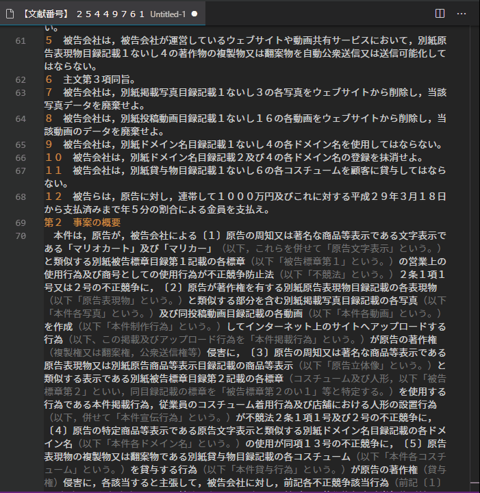

# hanreiHozon README
判例を保存する際のファイル名を生成します。

## 機能
判例（LEX／DBから取得したものに限る）のテキストデータを「名前を付けて保存」する際の名前を生成します。判例の出典情報をクリップボードに格納することもできます。

## 使い方
### ファイル名生成
LEX／DBの判例情報（書誌情報も含む）をコピーして、VSCodeに貼り付けて、以下のどれかの方法で実行します。ファイル名は'H280314 東京地裁[事件名]'という形式になります。ファイル名の事件名の部分は、実行する前に範囲選択をしている場合には、その範囲に含まれている文字列になります。範囲選択がない場合は空になりますので、自分で事件名を入力してください。
- コマンドパレットから'hanreiHozon'を呼び出す
- エディタのタイトルバーの「・・・」の部分をクリックして出てくるメニューから'henreihozon'を選択する（下画像参照）
- 'extension.hanreihozon'を適当なキーに割り当てる

### 出典情報のクリップボードへの格納
LEX／DBの判例情報（書誌情報も含む）から作成したテキストデータから、以下のどれかの方法で実行します。出典情報は、'東京地判平28・3・14判時○号○頁［事件名］'という形式になります。事件名の部分は、実行する前に範囲選択をしている場合には、その範囲に含まれている文字列になります。範囲選択がない場合は空になりますので、自分で事件名を入力してください。[設定を変更](#jump)することで、年月日の表記の方式を変更することもできます。
- コマンドパレットから'citationToClipboard'を呼び出す
- エディタのコンテキストメニュー（windowsの右クリックメニュー）からcitationToClipboard'を選択する（下画像参照）

#### 留意点
- 出典表記の優先順位は、民集→判時→判タ→事件番号となっており、それ以外の出典表記には対応していません。
- 最高裁判決（決定）については、すべて「最判（決）」になります。法廷名も付けたい場合は、手動で追加してください。

## Extension Settings
### Path
判例データを保存するフォルダを指定したい場合には、"Hanrei Hozon"設定の"Path"のところに、そのフォルダのパスを記述します。
例：	`C:\Users\xxxx\Documents\Hanrei`

### CitationToClipboard
「年月日の表記の方式を『平成○年○月○日』にする」にチェックを入れると、クリップボードに格納される出典情報の日付の表記の方式が「平成○年○月○日」のようになります（チェックしない場合の表記は「平○・○・○」）」。

## その他
不具合等については、私の[Twitterアカウント(ID: m_miyawaki)](https://twitter.com/m_miyawaki)に連絡してください。

## Release Notes

### 1.0.0
公開

